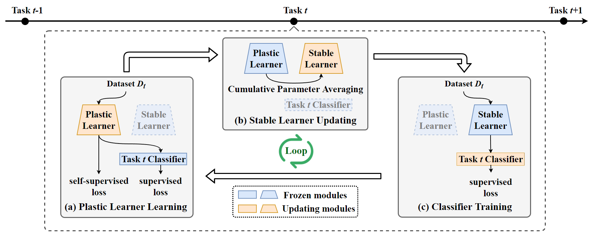

# Code for DLCPA

> Paper ID: 6691
>
> Paper Title: Towards Plastic and Stable Exemplar-free Incremental Learning: A Dual-learner Framework with Cumulative Parameter Averaging

## Setup

-   Use `./main.py` to run experiments.
-   Some training result can be found in folder `./result`.

## Datasets

**Class-IL / Task-IL settings**

-   Sequential CIFAR-100
-   Sequential Tiny ImageNet

## Requirement

+ numpy==1.16.4
+ Pillow==6.1.0
+ torch==1.3.1
+ torchvision==0.4.2

